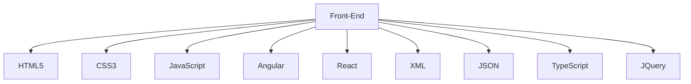

 

 <!---------------------------------bienvenida---------------------------------------------------------------------------------------------------->

[](https://github.com/ashutosh00710/github-readme-activity-graph)

<!---------------------------------estadistica---------------------------------------------------------------------------------------------------->

<div align="center">  
   
  
  
</div> 

<!---------------------------------tecnologia---------------------------------------------------------------------------------------------------->

<p align="center">
    <br/><br/><a href="https://www.linkedin.com/in/emiliano-landi-71423a120" target="_blank"></a>
    <a href="https://www.instagram.com/👽/" target="_blank"></a>
    <a href="https://twitter.com/👽" target="_blank"></a>
</p>
<p align="center"><a href="https://t.me/👽" target="_blank">
<p/>
  


<!---------------------------------redes---------------------------------------------------------------------------------------------------->

<!---------------------------------redes---------------------------------------------------------------------------------------------------->
<p align="center">
 
  
 
   
   
    
  
  
  
   
   
   

<p/>

<!----------------------------------------------Skill-*------------------------------------------------------------------------------------->
 ```geojson
{
  "type": "FeatureCollection",
  "features": [
    {
      "type": "Feature",
      "id": 1,
      "properties": {
        "ID": 0
      },
      "geometry": {
        "type": "Polygon",
        "coordinates": [
          [
              [-59,-34.9],
              [-57.9,-34.9],
              [-57.9,-34.9],
              [-59,-34.9],
              [-59,-34.9]
          ]
        ]
      }
    }
  ]
}
